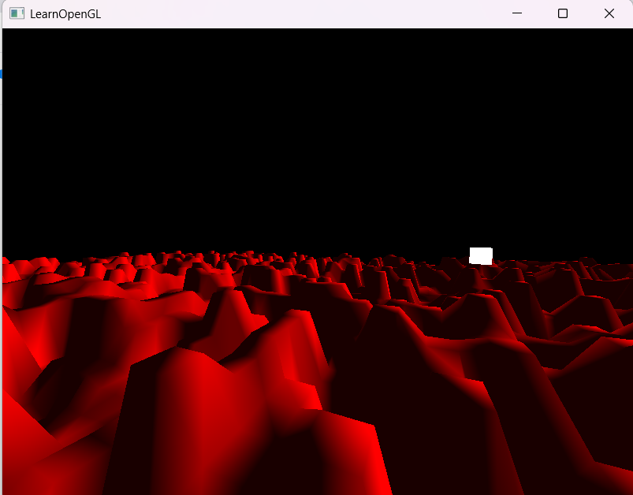

# Blog and project plan introduction
This 'blog' is written using the notes I wrote down during the whole process of the project. Unfortunately, I didn't write down the date and time for each part of the project process when I wrote the notes, but everything happened in about the span of a week. 

The initial plan for the project that I wanted to do was indeed procedural terrain generation, although I also toyed with the idea of extending the lab work from the course, terrain generation seemed more interesting at the start. Thus, I proceeded with that plan.

# Setting up
Setting up the project meant learning OpenGL, Visual Studio, and C++, none of which I had prior experience with before. Fortunately, I found a great website for OpenGL, namely https://learnopengl.com/. I started reading the 'Getting started' section and followed the instructions closely. Everything went pretty smoothly, but once I got to 'Hello Triangle', I did get a bit overwhelmed, especially with the shaders. 

I went searching for another tutorial or guide I could follow, and stumbled upon a previous student's blog. The blog is a series of tutorials that does the similar thing as learnOpenGL, but helps create a Cornell Box like the lab in the course. Link: https://openglcornellbox.wordpress.com/ 

The tutorials are very helpful and simpler to follow and understand. I followed them from part 1 to most of part 4, and double-checking with learnOpenGL to see the similarities and differences. The major difference with my implementation and the tutorial is that the blog uses the SDL library for the window creation, while I used GLFW for the window creation, similar to learnOpenGL. 

For the movement, and especially the mouse input, I followed the tutorial in learnOpenGL. The blog post loads models by hardcoding the vertices and storing them in a Model class, however my objective was to generate the vertices and create a mesh, which I also learned how to do through learnOpenGL.

# Set up complete! Next course of action
After setting up the rendering pipeline and camera movement, my first objective was to render a simple flat plane, so I could fully understand how to generate vertices and render a world. 

To achieve this, I created a class that would consist of the logic and data for the world, the Map class. While the world is 3D, the map itself is 2D and thus the data is stored in a 2D array. The values of this array is thus the elevation value for that coordinate. These values will be computed through some noise function to achieve natural-looking terrain.

Once this array is filled, the world should then be rendered by drawing vertices based on the array.

Additional features that I thought about implementing at this stage was lighting.

# Success in creating a flat plane!!
Weirdly enough, I wrote down this section title in my notes but didn't write anything more....? But I must've been successful in my first objective! 

# Adding lighting
So I suppose I found that lighting was a bigger priority than the terrain generation, as my next step was to add a light source. 

For this part, I followed learnOpenGL once more, and created a Lighting class that would help render the light source in the form of a cube. 

And here I finally have some images! 

So it seems I did manage to make a light source, but the previously flat red plane absorbed all the light and is also completely white. Upon removing the light source, the plane still remained white, which indicated a shader issue. Checking my View.cpp which consists of the rendering code, I found that the original shader program was overwritten by the new lighting shader, which is only meant to be activated specifically for the light cube. So the issue was quickly fixed by activating the original shader program before drawing the mesh, and letting the light shader be activated after. 

With this, I started extending the Lighting to include ambient, diffuse, and specular lighting, all by the help of learnOpenGL. 

Although, I'm not entirely sure if the specular light is correctly implemented, as the shadow is round even though the source is a cube..? However, rather than putting more time on the lighting, I wanted to continue with the terrain generation, and let the 'issue' be.

# Adding noise!
I wanted to try my hands at creating my own noise function rather than using a pre-existing noise function. I did find a Perlin noise header-only implementation on GitHub by Reputeless, https://github.com/Reputeless/PerlinNoise. I tested it out and used their noise2D() function, just to see if my rendering was working, and indeed it managed to give a sliiiiight curve.

The reason it changed so minimally is due to the fact that I did not apply frequency, amplitude, or octave, although I didn't know it back then. The definition of these words are explained in my project report.

I removed Reputeless' Perlin noise and set off to implement my own, finding several helpful articles, blogs, and videos that helped me understand what exactly the noise function is and how it works. In the end, I managed to write a 2D noise function and got the following results:

Pretty small hills, but there's a lot of them! 

# Frequency, amplitude, and color!
I tried my hand at adding color based on height, however I didn't have the time to fully create a function for this, thus the results are pretty muddy and unfortunately, ugly. 

At this point, I finally learned about frequency and amplitude, and tried playing around with them instead, finding fascination with frequency = 0.1.

For the coloring issue, I did find some links and ideas that might be helpful if I choose to work further on this project after turning it in for the course, such as: https://forums.unrealengine.com/t/how-can-i-colour-my-terrain-using-a-colour-gradient-based-on-the-elevation/419303 

I do think I will continue working on this. I'm pretty satisfied with what I've put out in such a short amount of time, and I regret procrastinating the project for such a long time. Overall, doing this project was tons of fun and I've certainly learned a lot!

Here are some more screenshots of me playing around with different values:

